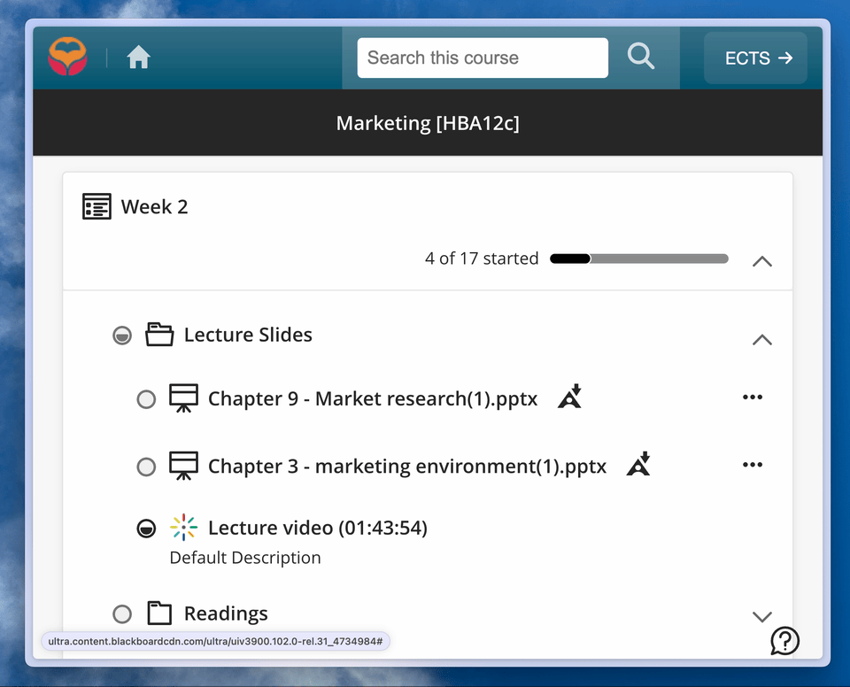

# KU Leuven Toledo Lecture Downloader

Adds a download button to the lecture player on the KU Leuven Toledo platform. The button will download the lecture in the highest available quality. Now available as both a browser extension and a cross-browser userscript.

## Installation

### Option 1: Userscript (Recommended - Works on all browsers)

1. **Install a userscript manager:**
   - **Chrome/Edge/Opera**: Install [Tampermonkey](https://chrome.google.com/webstore/detail/tampermonkey/dhdgffkkebhmkfjojejmpbldmpobfkfo) or [Violentmonkey](https://chrome.google.com/webstore/detail/violentmonkey/jinjaccalgkegednnccohejagnlnfdag)
   - **Firefox**: Install [Tampermonkey](https://addons.mozilla.org/en-US/firefox/addon/tampermonkey/) or [Violentmonkey](https://addons.mozilla.org/en-US/firefox/addon/violentmonkey/)
   - **Safari**: Install [Tampermonkey](https://apps.apple.com/us/app/tampermonkey/id1482490089)

2. **Install the userscript:**
   - Click here to install: [ku-leuven-lecture-downloader.user.js](https://github.com/breitburg/toledo-download-extension/raw/main/ku-leuven-lecture-downloader.user.js)
   - Or manually copy the script content and create a new userscript in your manager

### Option 2: Chrome Extension (Chrome/Edge only)

1. Clone the repository
2. Open `chrome://extensions/` in your browser
3. Enable developer mode
4. Click on "Load unpacked"
5. Select the cloned repository

## Browser Compatibility

| Browser | Userscript Support | Extension Support |
|---------|-------------------|-------------------|
| Chrome | ✅ (Tampermonkey/Violentmonkey) | ✅ |
| Firefox | ✅ (Tampermonkey/Violentmonkey) | ❌ |
| Safari | ✅ (Tampermonkey) | ❌ |
| Edge | ✅ (Tampermonkey/Violentmonkey) | ✅ |
| Opera | ✅ (Tampermonkey/Violentmonkey) | ❌ |

**Recommendation**: Use the userscript version for maximum compatibility across all browsers.

## License

This project is licensed under the [The Unlicense](LICENSE).
